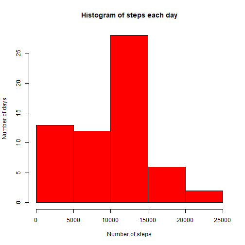
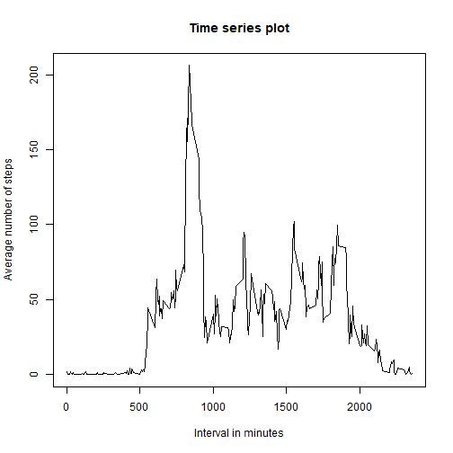
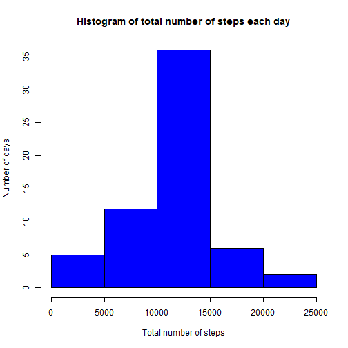
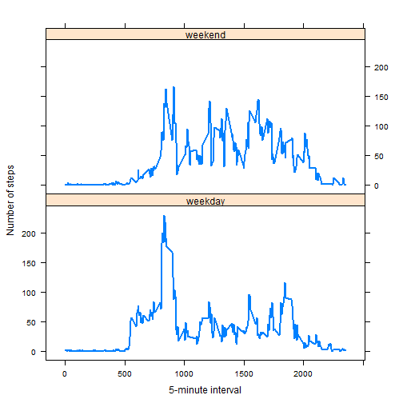

It is now possible to collect a large amount of data about personal movement using activity monitoring devices such as a Fitbit, Nike Fuelband, or Jawbone Up. These type of devices are part of the "quantified self" movement - a group of enthusiasts who take measurements about themselves regularly to improve their health, to find patterns in their behavior, or because they are tech geeks. But these data remain under-utilized both because the raw data are hard to obtain and there is a lack of statistical methods and software for processing and interpreting the data.

This assignment makes use of data from a personal activity monitoring device. This device collects data at 5 minute intervals through out the day. The data consists of two months of data from an anonymous individual collected during the months of October and November, 2012 and include the number of steps taken in 5 minute intervals each day.

## Load the data


```r
library(readr)
activity <- read_csv("C:/Users/lbw92/Desktop/activity.csv")
```

```
## Parsed with column specification:
## cols(
##   steps = col_integer(),
##   date = col_date(format = ""),
##   interval = col_integer()
## )
```

```r
summary(activity)
```

```
##      steps             date               interval     
##  Min.   :  0.00   Min.   :2012-10-01   Min.   :   0.0  
##  1st Qu.:  0.00   1st Qu.:2012-10-16   1st Qu.: 588.8  
##  Median :  0.00   Median :2012-10-31   Median :1177.5  
##  Mean   : 37.38   Mean   :2012-10-31   Mean   :1177.5  
##  3rd Qu.: 12.00   3rd Qu.:2012-11-15   3rd Qu.:1766.2  
##  Max.   :806.00   Max.   :2012-11-30   Max.   :2355.0  
##  NA's   :2304
```

## What is the total number of steps taken every day?

Make a histogram of the total number of steps taken each day.

Calculate and report the mean and median total number of steps taken each day.


```r
steps.date <- aggregate(activity$steps,list(activity$date),sum,na.rm=TRUE)
colnames(steps.date ) <- c("date","steps")
head(steps.date)
```

```
##         date steps
## 1 2012-10-01     0
## 2 2012-10-02   126
## 3 2012-10-03 11352
## 4 2012-10-04 12116
## 5 2012-10-05 13294
## 6 2012-10-06 15420
```

```r
hist(steps.date$steps,ylab="Number of days",xlab="Number of steps",col="red",main="Histogram of steps each day")
```



```r
mean(steps.date$steps)
```

```
## [1] 9354.23
```

```r
median(steps.date$steps)
```

```
## [1] 10395
```

## What is the average daily activity pattern?

Make a time series plot (i.e. type = "l") of the 5-minute interval (x-axis) and the average number of steps taken, averaged across all days (y-axis)

Which 5-minute interval, on average across all the days in the dataset, contains the maximum number of steps?


```r
interval <- aggregate(activity$steps,list(activity$interval),mean,na.rm=TRUE)
colnames(interval) <- c("interval","steps_mean")
head(interval)
```

```
##   interval steps_mean
## 1        0  1.7169811
## 2        5  0.3396226
## 3       10  0.1320755
## 4       15  0.1509434
## 5       20  0.0754717
## 6       25  2.0943396
```

```r
plot(interval$interval,interval$steps_mean,type="l",xlab="Interval in minutes",ylab="Average number of steps",main="Time series plot")
```



```r
interval[which.max(interval$steps),]
```

```
##     interval steps_mean
## 104      835   206.1698
```

## Imputing missing values

Note that there are a number of days/intervals where there are missing values (coded as NA). The presence of missing days may introduce bias into some calculations or summaries of the data.

Calculate and report the total number of missing values in the dataset (i.e. the total number of rows with NAs)

Devise a strategy for filling in all of the missing values in the dataset. The strategy does not need to be sophisticated. For example, you could use the mean/median for that day, or the mean for that 5-minute interval, etc.
Create a new dataset that is equal to the original dataset but with the missing data filled in.

Make a histogram of the total number of steps taken each day and Calculate and report the mean and median total number of steps taken per day. Do these values differ from the estimates from the first part of the assignment? What is the impact of imputing missing data on the estimates of the total daily number of steps?


```r
sum(is.na(activity$steps))
```

```
## [1] 2304
```

```r
interval.mean <- aggregate(steps ~ interval, activity , FUN = mean)
for (i in 1:nrow(activity)){
     tmp <- activity$steps[i]
     if(is.na(tmp)){
         for(j in 1:nrow(interval.mean)){
             if(activity$interval[i] == interval.mean$interval[j]){
                 activity$steps[i] = interval.mean$steps[j]
                 break
             }
         }
     }  
 }
head(activity)
```

```
## # A tibble: 6 x 3
##       steps       date interval
##       <dbl>     <date>    <int>
## 1 1.7169811 2012-10-01        0
## 2 0.3396226 2012-10-01        5
## 3 0.1320755 2012-10-01       10
## 4 0.1509434 2012-10-01       15
## 5 0.0754717 2012-10-01       20
## 6 2.0943396 2012-10-01       25
```

```r
steps.all <- aggregate(activity$steps,list(activity$date),sum)
colnames(steps.all ) <- c("date","sum")
hist(steps.all$sum,ylab="Number of days",xlab="Total number of steps",col="blue",main="Histogram of total number of steps each day")
```



```r
mean(steps.all$sum)
```

```
## [1] 10766.19
```

```r
median(steps.all$sum)
```

```
## [1] 10766.19
```
Both mean and median values differ from the first part of assignment. Inputting missing data increase the estimate of total daily number of steps

## Are there differences in activity patterns between weekdays and weekends?

For this part the weekdays() function may be of some help here. Use the dataset with the filled-in missing values for this part.

Create a new factor variable in the dataset with two levels - "weekday" and "weekend" indicating whether a given date is a weekday or weekend day.
Make a panel plot containing a time series plot (i.e. type = "l") of the 5-minute interval (x-axis) and the average number of steps taken, averaged across all weekday days or weekend days (y-axis). See the README file in the GitHub repository to see an example of what this plot should look like using simulated data.


```r
library(timeDate)
activity$day <- ifelse(isWeekday(activity$date) == TRUE,"weekday","weekend")
activity$day <- as.factor(activity$day)

weekday.mean <- aggregate(steps ~ interval+day,activity,mean)
library(lattice)
xyplot(steps ~ interval|day,data=weekday.mean,type="l",lwd=2,layout=c(1,2),
       xlab="5-minute interval",ylab="Number of steps")
```


